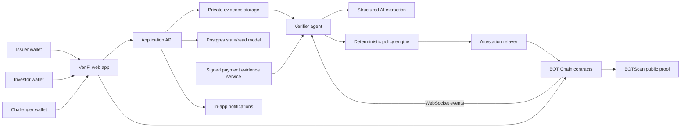
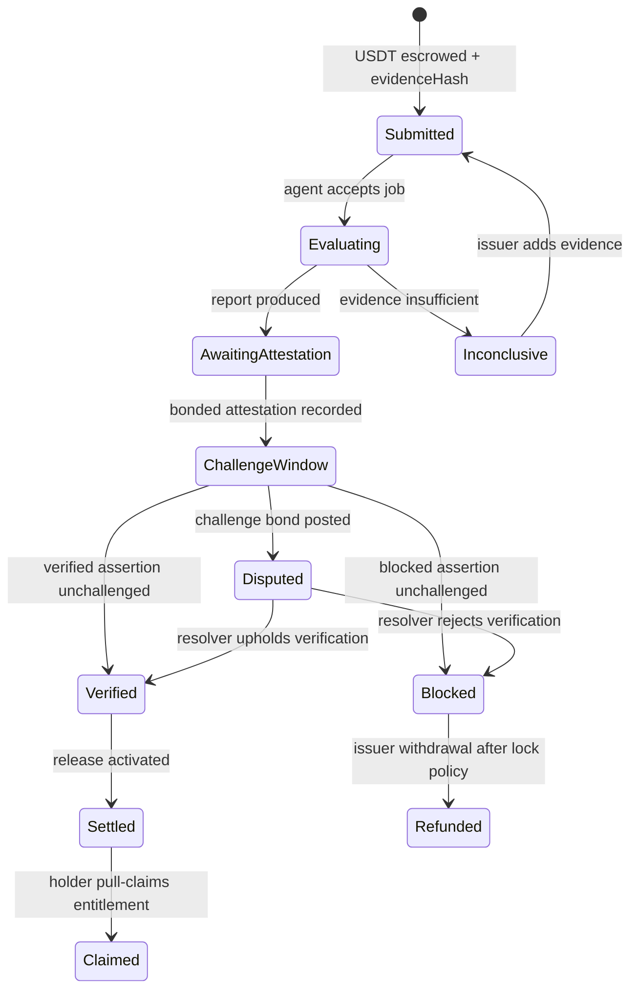
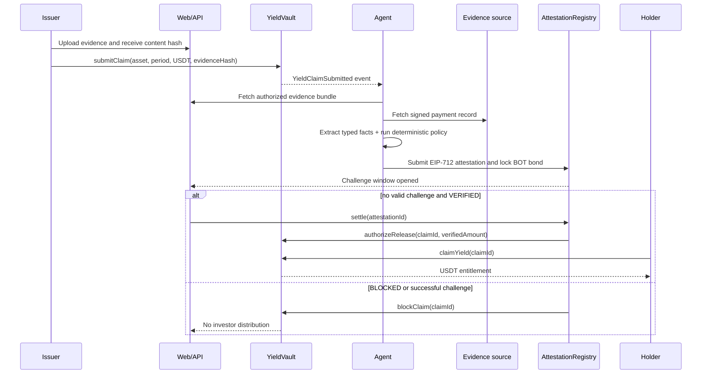

# System architecture

## 1. Architectural principles

1. **Fail closed:** missing, malformed, stale, contradictory, or low-quality evidence cannot release funds.
2. **Rules decide; AI extracts and explains:** the model converts unstructured material into typed facts and flags anomalies. A versioned deterministic policy maps facts to an outcome.
3. **On-chain funds, off-chain evidence:** contracts hold money and lifecycle truth; private documents remain off-chain with hashes anchored on-chain.
4. **Economic liability is explicit:** every actionable attestation locks verifier stake until finality.
5. **Pull payments:** investors claim their own entitlement; the protocol never loops over all holders.
6. **Idempotent workers:** repeated events and retries cannot create duplicate claims or attestations.
7. **Optional systems degrade safely:** model, notification, and metadata failures do not turn into approvals.

## 2. Context diagram

## 3. Runtime components

| Component | Responsibility | Proposed implementation |
|---|---|---|
| `apps/web` | Product UI, wallet transactions, public verification history | Next.js, TypeScript, wagmi, viem, Tailwind/shadcn |
| `apps/api` | Evidence upload, signed URLs, read model, fixture oracle, notifications | Fastify or Next.js route service, Zod, Postgres |
| `apps/agent` | Event recovery/subscription, evidence pipeline, typed extraction, signing/relay | Node/TypeScript, viem, structured model output |
| `packages/contracts` | Assets, escrow, attestation, challenge, slashing, distribution | Solidity, Hardhat 3, OpenZeppelin |
| `packages/policy` | Pure deterministic verification rules | TypeScript, no network dependencies |
| `packages/schemas` | Canonical API, evidence, report, and EIP-712 schemas | Zod plus generated JSON Schema |
| `packages/config` | Chain/address manifests and environment validation | TypeScript |
| `fixtures` | Golden cases and offline demo inputs | Redacted JSON/PDF/image fixtures |
| `scripts/doctor` | External-system capability and configuration checks | TypeScript CLI |

## 4. Claim state machine

No transition may skip the challenge window in production. Demo time compression changes durations, not transition rules.

## 5. End-to-end sequence

## 6. Data ownership and storage

On-chain:

- asset ID, issuer, token, policy hash/version;
- claim period, amount, evidence root, token snapshot ID;
- verifier, outcome, verified amount, report hash, bond amount;
- challenge/resolution state and timestamps;
- released amount and per-wallet claim status.

Off-chain:

- redacted lease and payment documents;
- OCR/model extracts;
- complete verification report;
- evidence-source response and signature;
- UI read model and notification state.

The public report contains hashes/references and redacted reasoning, not bank account numbers, tenant names, or raw documents.

## 7. Environments

| Environment | Chain | Evidence | Settlement |
|---|---|---|---|
| Unit | Hardhat/none | Inline fixtures | Mock tokens |
| Local integration | Hardhat EDR node | Seeded object store/DB | MockUSDT, 6 decimals |
| Offline demo | Local or public UI fixture mode | Committed golden fixtures | Clearly labeled simulation |
| Testnet | BOT testnet 968 | Hosted sandbox evidence | MockUSDT unless official token confirmed |
| Mainnet | BOT Mainnet 677 | Hosted sandbox/real-redacted evidence | Official USDT |

The offline mode is a resilience path, never presented as Mainnet proof.
